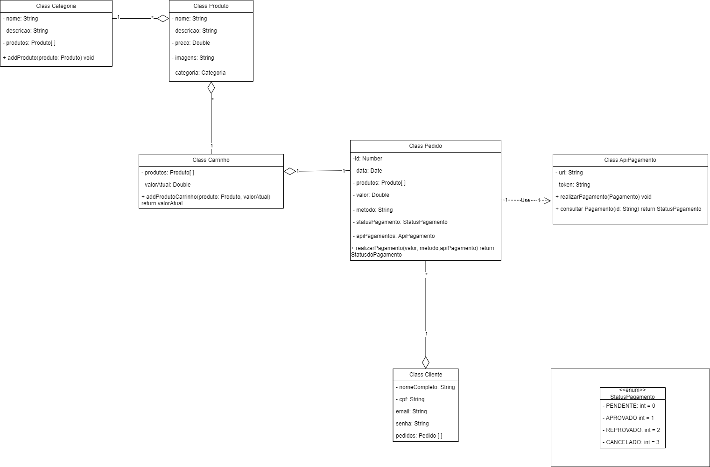

# Workshop-CloneKabum

## Sobre o projeto
- O projeto será um clone do site e-commerce Kabum, este projeto visa apenas testar habilidades adquiridas pelo desenvolvedor dono deste gitHub e não tem nenhum intuito comercial de concorrer com o site original.

## Objetivo
- Temos um tipo específico de usuarios, que são pessoas que estão em busca de adquirir por meio de uma compra online, produtos eletrônicos em geral como peças de hardware e periféricos.
- Como proposta de software, iremos nos atentar **principalmente** no modelo de negócio e na transação de compra e venda dos produtos.
  
## Requisitos
### Requisitos funcionais:
- Para o cliente, precisamos do Nome Completo, CPF, e-mail e Senha. CPF e e-mails devem ser únicos no sistema. Sendo assim, seu sistema deve permitir apenas um cadastro com o mesmo CPF ou endereço de e-mail.
- Para uma compra o cliente deve deve estar cadastrado e fornecer as informações básicas do pedido, como nome, endereço e método de pagamento. Um cliente pode ter um ou mais pedidos.
- Para o produto, precisamos do nome, descrição, preço, categoria e imagens. Um produto pertence apenas a uma categoria.
- Para o pedido, precisamos da data, id unico, produto, valor, método e status de pagamento. Um pedido poderá realizar apenas um pagamento.
- Para as categorias deveremos ter o nome, descrição e produtos.
- Para o carrinho, precisamos que seja possivel adicionar quantos produtos o cliente quiser e fornecer o valor total do pedido atualizado.
- O sistema deve permitir que os clientes criem pedidos de compra.
- O sistema deve validar as informações fornecidas pelo cliente.
- O sistema deve permitir que os clientes escolham o método de pagamento.
- O sistema deve processar o pagamento do pedido.
- O sistema deve se comunicar com uma API de pagamento para processar o pagamento.
- O sistema deve fornecer o status de pagamento para o usuário sempre que for atualizado.
- Este serviço deve ser RESTFUL.

## Requisitos não funcionais
- Segurança:
  - O sistema deve proteger as informações dos clientes, incluindo nome, endereço e dados de pagamento.
  - O sistema deve usar protocolos de segurança padrão, como HTTPS.
    
- Eficiência:
  - O cliente deve poder navegar pelos produtos disponíveis.
  - O cliente deve poder adicionar produtos ao carrinho de compras.
  - O sistema deve manter o total do pedido atualizado.
  - O valor do pedido deve incluir o preço dos produtos, as taxas de envio e quaisquer outros custos aplicáveis.
  - O sistema deve suportar os seguintes métodos de pagamento: cartão de crédito, boleto bancário, débito em conta e pix.
  - O sistema deve responder rapidamente às solicitações dos clientes.
  - O sistema deve ser capaz de lidar com um grande número de usuários simultâneos.
    
- Usabilidade:
  - O sistema deve ser fácil de usar e acessível a todos os usuários.
  - O sistema deve fornecer feedback claro e conciso aos usuários.
    
## Ambiente operacional
- O sistema deve ser compatível com os navegadores web mais populares.

## Critérios de aceitação
- O sistema deve atender a todos os requisitos funcionais e não funcionais especificados.

## Diagrama de classes

## Tecnologias
### Linguagens:
- Back-end: Java 21(LTS)
- Front-end: Html, CSS3, JavaScript
  
### Frameworks:
- SpringBoot (Back-end)
- Front-end (A definir)

### Banco de Dados:
- H2 (Teste)
- Produção (A definir)
